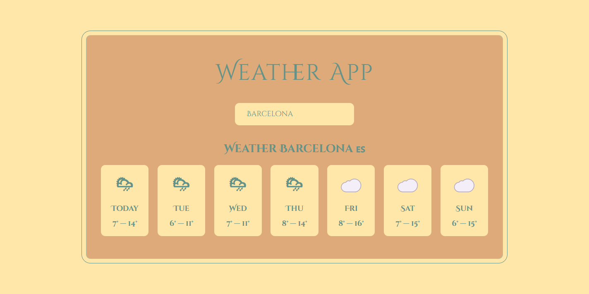

# Weather App

This is a simple weather app built with React. It allows you to search for the weather in a specific city, and it displays the current weather, as well as a 5-day forecast.

## Features

* Search for the weather in a specific city
* Displays the current weather
* Displays a 7-day forecast

## Built With

* React
* JavaScript
* HTML/CSS

## Getting Started

1. Clone the repository
2. Run `npm install` to install the dependencies
3. Run `npm start` to start the app

## Authors

* [Ionut](https://github.com/PuenaruIonutMarian/weatherApp.git)

## License

This project is licensed under the MIT License - see the [LICENSE.md](LICENSE.md) file for details

## Acknowledgments

* [Open-meteo API](https://open-meteo.com/) for providing the weather data
* [React](https://reactjs.org/) for making this app possible
# weatherApp
